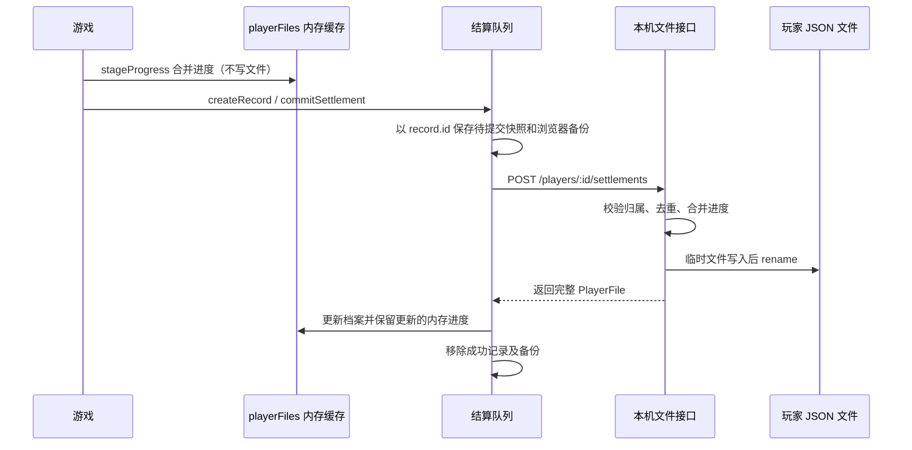

# 数据流

## 1. 应用启动

1. `index.html` 加载 `src/main.tsx`，挂载 `<App />`。
2. `src/App.tsx:12` 配置 HashRouter，路由为 `/`、`/game/:id`、`/profile`、`/gamepad`；`SaveStatus` 显示全局保存状态，`PlayerGate` 控制页面准入。
3. `src/store/userStore.ts:17` 将恢复状态从 `idle` 切为 `loading`，读取 `mini-games-last-player`，调用 `loadPlayerFile` 请求并校验档案，写入内存缓存。
4. 恢复完成后状态为 `ready`；缺少 ID、文件不存在或已归档时显示玩家选择入口。`UserSelector` 创建/选择玩家并加载档案后才设置 `currentUser`。

玩家切换以 `src/components/UserSelector.tsx:51` 为入口。Zustand 保存内存状态，localStorage 只记住上次玩家 ID；旧 `mini-game-user` 快照不再用于恢复。

## 2. 广场首页加载

```text
Home
  ├─ getGames → gameCatalog → 注册 manifest
  │    └─ 过滤 hiddenGameIds → 初次访问随机排列
  └─ getPlayRanking → 本机未归档玩家文件中的已结算记录
       └─ 过滤 hiddenGameIds → 显示前五名，优先排列对应游戏卡片
```

`getGames` 是内存清单的 Promise 包装。排行没有种子数据；按 `playCount` 降序、`totalDuration` 降序、`gameId` 字典序排列，并排除已移除注册的游戏（`src/api/index.ts:96`、`src/features/games/playStats.ts:55`）。

首页在挂载和浏览器 `storage` 事件时刷新排行，没有文件变更订阅或轮询（`src/pages/Home.tsx:30`）。单纯打开游戏、尚未结算的游玩和 `useGamePlay` 的内存计时不会直接增加持久化排行。

## 3. 进入游戏

```text
GameLaunchLink
  ├─ embedded → /game/:id → GameDetail → getGameComponent → Suspense
  ├─ external → HTTPS 新标签页链接
  └─ 未注册 → aria-disabled 的非链接展示
```

内置组件通过 `runtime.load` 懒加载；当前玩家存在时，使用 `${id}:${currentUser.id}` 作为组件 key。切换游戏或玩家会重建相应实例（`src/pages/GameDetail.tsx:65`）。外链能力由 `src/components/GameLaunchLink.tsx:16` 统一处理，当前注册游戏均为内置实现。

## 4. 对局与战绩提交流



`createRecord` 校验玩家 ID 格式和游戏注册状态，将分数、秒数四舍五入并约束为非负数；默认以 `crypto.randomUUID()` 生成 ID，也允许调用方传入 ID。服务端再校验玩家文件、归属和字段，接口细节见 [API 契约](../contracts/apis.md)。

### 防重与失败恢复

| 场景             | 当前行为与证据                                                                                                                                                                            |
| ---------------- | ----------------------------------------------------------------------------------------------------------------------------------------------------------------------------------------- |
| 游戏重复触发结算 | `useGameRecord` 用 ref 阻止重复提交；调用方需在开局时重置。`src/hooks/useGameRecord.ts:32`                                                                                                |
| 多条结算并发     | 客户端串行发送；文件仓库在同一实例内串行执行写操作。没有跨进程文件锁。`src/api/playerFiles.ts:135`、`scripts/player-data.ts:20`                                                           |
| 相同记录重试     | 同 ID、同记录内容直接返回现有档案，不再次追加或合并；同 ID 内容不同则报错。`src/features/players/schema.ts:140`                                                                           |
| 断网或响应丢失   | 待保存快照留在队列，并尽力备份到 `mini-games-pending-settlements-v1`；全局提示提供手动重试，沿用原记录 ID。`src/api/playerFiles.ts:140`                                                   |
| 刷新或离开页面   | 初始化时恢复备份，加载玩家时恢复对应待提交进度；存在 pending 时尝试触发浏览器离开提醒。浏览器备份失败时不能保证刷新后恢复。`src/api/playerFiles.ts:19`、`src/components/SaveStatus.tsx:6` |

文件保存不保证每次进度变化都立即落盘；只有暂存进度、没有提交结算时，不能据此认定档案已保存。部分游戏另有浏览器存储，见第 6 节。

## 5. 个人统计

`getUserStats` 读取指定玩家文件，将各游戏记录合并后计算总场次、时长、分数，并按游戏聚合 `playCount`、`bestScore`、`totalTime`（`src/api/index.ts:28`）。

个人统计保留已移除注册游戏的历史，无法解析名称时回退到 `gameId`；热门排行则排除这些游戏。`getRecords` 按 `playedAt`、`id` 升序返回记录；两者均不包含尚未保存的结算队列。

## 6. 游戏内成长

玩家文件中的 `games[gameId]` 同时包含 `progress` 与 `records`。`readPlayerProgress` 读取已加载档案的内存副本，`stageProgress` 合并进度；共用合并规则见 [领域实体](../domain/entities.md#progressdata-与合并规则)。

| 游戏 / 数据                          | 当前路径                                                           | 来源                                                                          |
| ------------------------------------ | ------------------------------------------------------------------ | ----------------------------------------------------------------------------- |
| 引力墓场、折光回廊、象棋、贪吃蛇成长 | 从玩家缓存读取，暂存后随结算提交                                   | 各游戏 `progression.ts`；例如 `src/games/gravity-graveyard/progression.ts:20` |
| 坦克战役进度                         | 按玩家、战役、单人/双人模式存入档案；显式传入 storage 时走兼容分支 | `src/games/tank-battle/progress.ts:40`                                        |
| 扫雷逻辑关卡                         | 合并旧浏览器进度与档案；有玩家时暂存文件进度，访客分支写浏览器     | `src/games/minesweeper/progression.ts:7`                                      |
| 五子棋残局                           | 合并浏览器与档案进度；写浏览器副本，有玩家时同时暂存文件进度       | `src/games/gomoku/progression.ts:16`                                          |
| 打砖块关卡结算                       | 每关尝试独立计算分数、时长与续玩进度                               | `src/games/breakout/settlement.ts:1`                                          |
| 编辑器、音效与菜单偏好               | 浏览器存储，不随玩家文件自动迁移                                   | 下表及对应模块                                                                |

底层函数中的访客兼容分支，不代表当前 `PlayerGate` 开放无玩家游玩。

### 旧数据迁移

`src/features/players/migration.ts:22` 从旧用户列表和记录生成版本 1 玩家文件，保留用户与记录 ID，并转换象棋、折光回廊和坦克进度。游客认领独立执行，还包含旧引力墓场成长；扫雷和五子棋由各自的进度模块兼容浏览器数据。

导入成功后保留浏览器原数据，文件中的 `legacyImported` / `guestImported` 防止重复导入；界面另写浏览器提示标记。损坏的 JSON 或文件会报错，不自动覆盖原始内容（`scripts/player-data.ts:103`）。

## 7. localStorage 键总览

### 当前辅助数据

| Key                                                            | 内容 / 作用域                        | 读写入口                                                                     |
| -------------------------------------------------------------- | ------------------------------------ | ---------------------------------------------------------------------------- |
| `mini-games-last-player`                                       | 上次玩家 ID                          | `src/store/userStore.ts:23`                                                  |
| `mini-games-pending-settlements-v1`                            | 尚未确认成功的结算快照，包含玩家归属 | `src/api/playerFiles.ts:13`                                                  |
| `mini-games-imported:<userId>`、`mini-games-guest-imported-to` | 旧玩家导入提示、游客认领标记         | `src/components/UserSelector.tsx:82`、`src/features/players/migration.ts:89` |
| `<gameId>:puzzles:v1:<userId或guest>` 及其 `:selected` 后缀    | 五子棋残局副本与选关位置             | `src/games/gomoku/progression.ts:4`                                          |
| `minesweeper:logic:v1:<userId或guest>`                         | 扫雷兼容进度；当前写入分支为 guest   | `src/games/minesweeper/progression.ts:5`                                     |
| `mini-games-tank-selected-campaign`                            | 浏览器级战役选择                     | `src/games/tank-battle/progress.ts:9`                                        |
| `mini-games-tank-maps-v1`、`mini-games-tank-draft-v1`          | 浏览器级自定义地图与草稿             | `src/games/tank-battle/editor/storage.ts:3`                                  |
| `mini-games-breakout-level-v1`、`mini-games-breakout-audio-v1` | 浏览器级自定义关卡与音效设置         | `src/games/breakout/editor.ts:5`、`src/games/breakout/audio.ts:27`           |

### 迁移来源

`mini-games-local-users`、`mini-games-local-records`、`mini-games-xiangqi-progress:*`、`mini-games-laser-mirror:*`、`mini-games-tank-progress-v1:*`、`mini-games-local-progression:gravity-graveyard` 的精确旧键构造见 `src/features/players/migration.ts:27`。它们不是当前玩家文件接口的写入目标。

清除 localStorage 不会删除已经保存的玩家 JSON，但会影响上述浏览器数据及待保存备份。恢复和备份步骤见 [排障手册](../runbooks/debugging.md#第-2-层数据层玩家文件与浏览器存储)。
