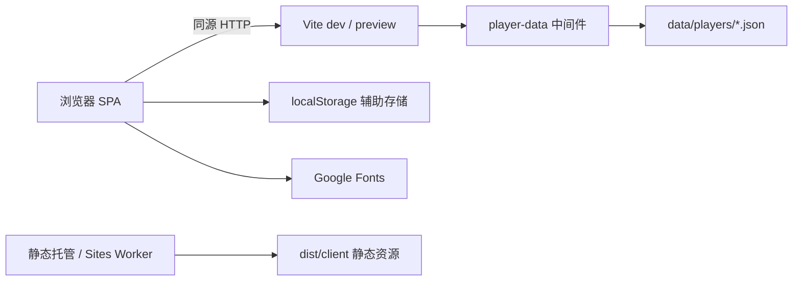

# 系统上下文

## 边界

mini-games-fe 包含浏览器 SPA 和本机文件存档中间件。`vite.config.ts:7` 注册 `playerDataPlugin`，在开发和预览服务中挂载 `/__player-data/players`，将数据写入项目根目录的 `data/players/`（`scripts/player-data.ts:205`）。

### 运行环境

| 环境                        | 当前能力                            | 边界                                           |
| --------------------------- | ----------------------------------- | ---------------------------------------------- |
| `npm run dev`               | 页面、热更新、玩家文件接口          | 默认本机端口 5183                              |
| `npm run preview`           | 构建页面、玩家文件接口              | 先构建；通过 Vite 预览插件提供接口             |
| 独立静态托管 / Sites Worker | HTML、JS、CSS、图片、音频和资源回退 | 未实现文件接口，不能完成当前玩家选择与存档流程 |

客户端会检查接口响应是否为 JSON；静态回退返回 HTML 时提示缺少文件存档服务（`src/api/playerFiles.ts:55`）。`PlayerGate` 在玩家档案就绪前不会放行路由页面（`src/components/PlayerGate.tsx:5`）。因此，静态资源可加载不代表完整应用可用。

当前没有云端存档服务。独立静态站点是否仍为目标部署形态、对应存档服务采用何种方案：**待确认**。以上能力判断基于仓库实现，不代表线上环境已完成验证。

## 上下文映射

| 角色 / 资源  | 交互方式               | 说明                                                                        |
| ------------ | ---------------------- | --------------------------------------------------------------------------- |
| 终端用户     | 鼠标、键盘、触屏、手柄 | 支持范围取决于具体游戏；手柄诊断页为 `/#/gamepad`                           |
| 本机文件服务 | 同源 HTTP JSON         | 仅接受 `localhost`、`127.0.0.1`、`[::1]` Host；有 Origin 时要求与 Host 一致 |
| 玩家文件     | Node 文件读写          | 版本化 schema；归档保留文件；写入通过临时文件 rename 替换                   |
| localStorage | 浏览器同步读写         | 与文件存档并存，具体归属见 [数据流](./data-flow.md)                         |
| Google Fonts | HTTPS                  | `index.html:8` 引入字体，失败时按字体栈回退                                 |

文件接口限制由 `scripts/player-data.ts:136`、`scripts/player-data.ts:166` 实现，包含 JSON Content-Type 和 5 MB 请求上限；它们不构成公网账号认证。当前所有已注册游戏均使用 `embedded`，但 manifest 保留 `external` 能力。

## 不做什么

- 不提供公网账号注册、密码认证或云端自动同步；创建本机玩家档案不等于注册在线账号。
- 不提供网络多人联机；坦克大战的双人模式属于本机协作。
- 静态 Worker 不承担玩家数据 API。部署要求见 [发布手册](../runbooks/release.md)。
